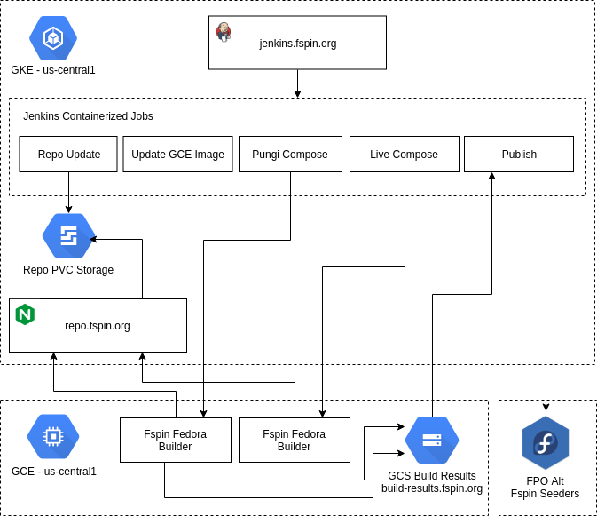

# Fspin k8s Based Infrastructure


* TODO: Automate pipeline based on SCM events.
* TODO: Automate openqa testing.
* TODO: Make everything more generic.
* TODO: A lot.

## Creating a Respin - SIG Members
Details on how to use Jenkins to create a respin and interact with the results.

### Install Tools
Install gcloud sdk to make interacting with [GCS](https://cloud.google.com/storage/) easy via `gsutil`.

Setup the upstream gcloud SDK repo, if needed:
```console
$ sudo tee -a /etc/yum.repos.d/google-cloud-sdk.repo << EOM
[google-cloud-sdk]
name=Google Cloud SDK
baseurl=https://packages.cloud.google.com/yum/repos/cloud-sdk-el7-x86_64
enabled=1
gpgcheck=1
repo_gpgcheck=1
gpgkey=https://packages.cloud.google.com/yum/doc/yum-key.gpg
       https://packages.cloud.google.com/yum/doc/rpm-package-key.gpg
EOM
```

Install gcloud SDK:
```console
$ sudo dnf install google-cloud-sdk
```

### Login to Jenkins
[Jenkins](https://jenkins.fspin.org/) is configured to run all of the needed jobs. Login with your FAS account with spin SIG membership.

### Overview
Update the repo from upstream, create a new snapshot and builder via `create-snapshot`. 
Create a spin using the latest snapshot and matching builder via `create-fspin`. 
Publish the results of a the spin via `publish-fspin`. 
Results publish to [build-results](http://build-results.fspin.org)

### Create a Snapshot
The snapshot job updates the repos to match current upstream, creates a time based snapshot of the repos, boots and updates the official image to the snapshot and creates a builder from that instance. This builder is now used for all spin activities to ensure all installed package and the running kernel matches the spin target.

### Create Fspin
The spin job launches a pipeline of builds that launch their own dedicated virtual machines running the target snapshot. These instances are configured to explicitly use the snapshot they were updated to for dnf, mock, lmc, pungi, etc.

### Publish the Results
The publish job takes the spin results and publishes them to a known location in the build-results GCS storage, combining the hashes and cleaning up. In the future this phase would also do activities such as generating deltas for packages installed, etc.

### Accessing the Results
To download the results browse to the [build-results](http://build-results.fspin.org) and construct a download url manually to fetch files. Alternatively, use `gsutil` for easy access to this content.

List what releases are available:
```console
gsutil ls gs://build-results.fspin.org/releases/
```

Download a published spin locally:
```console
gsutil cp -r gs://build-results.fspin.org/releases/YYYY-MM-DD .
```

## Developer Quickstart
These are very specific to the fspin project.

### Install Tools
Install tools for working with this infrastructure:
```console
$ sudo dnf install docker kubernetes-client git
```

Setup the upstream gcloud SDK repo, if needed:
```console
$ sudo tee -a /etc/yum.repos.d/google-cloud-sdk.repo << EOM
[google-cloud-sdk]
name=Google Cloud SDK
baseurl=https://packages.cloud.google.com/yum/repos/cloud-sdk-el7-x86_64
enabled=1
gpgcheck=1
repo_gpgcheck=1
gpgkey=https://packages.cloud.google.com/yum/doc/yum-key.gpg
       https://packages.cloud.google.com/yum/doc/rpm-package-key.gpg
EOM
```

Install gcloud SDK:
```console
$ sudo dnf install google-cloud-sdk
```

Install helm (yes, this is nasty):
```console
curl https://raw.githubusercontent.com/kubernetes/helm/master/scripts/get | bash
```

### Clone the Git Repo
Clone the git repo read/write:
```console
$ git clone git@github.com:fspin-k8s/fspin-infrastructure.git
```

### Setup Docker Environment
*https://developer.fedoraproject.org/tools/docker/docker-installation.html*
Allow your user to use docker without sudo:
```console
$ sudo groupadd docker && sudo gpasswd -a ${USER} docker && sudo systemctl restart docker
$ newgrp docker
```

### Setup GCP Environment
Login to project and set config defaults:
```console
$ gcloud init
$ gcloud config set project fspin-199819
$ gcloud config set compute/zone us-east4-c
$ gcloud auth configure-docker
$ gcloud container clusters list
```

Get credentials for the cluster:
```console
$ gcloud container clusters get-credentials fspin
```

Verify cluster is correctly configured on the client:
```console
$ kubectl get all --namespace kube-system
```

### Build Docker Layers and Push to [GCR](https://cloud.google.com/container-registry/)
This will build the layers locally and publish them as `latest` to GCR where the cluster pulls images from to run the containers. Please note that whatever is pushed last is considered `latest` even if it's an old version so be sure to know what you are pushing. This only needs to be done if you are changing the layers or they don't already exist in the registry.

Start docker, if needed:
```console
$ sudo systemctl start docker
```

Make sure you are working with all of the latest layers. Clean up your local docker and start fresh:
```console
$ docker system prune -a
```

Build the Jenkins runner image that has kubectl included and push to GCR:
```console
$ docker build -t gcr.io/fspin-199819/fspin-jenkins-runner jenkins-runner
$ docker push gcr.io/fspin-199819/fspin-jenkins-runner
```

Create the image to update the repo/snapshot and push to GCR:
```console
$ docker build -t gcr.io/fspin-199819/fspin-repo-update repo-update
$ docker push gcr.io/fspin-199819/fspin-repo-update
```

Create the image to serve the repo and push to GCR:
```console
$ docker build -t gcr.io/fspin-199819/fspin-repo-server repo-server
$ docker push gcr.io/fspin-199819/fspin-repo-server
```

Create the image that imports the upstream image and push to GCR:
```console
$ docker build -t gcr.io/fspin-199819/fspin-cloud-image-import cloud-image-import
$ docker push gcr.io/fspin-199819/fspin-cloud-image-import
```

Create the image to build the updated GCE image and push to GCR:
```console
$ docker build -t gcr.io/fspin-199819/fspin-x86-64-builder-update builder-update
$ docker push gcr.io/fspin-199819/fspin-x86-64-builder-update
```

Create the image that spins live images and push to GCR:
```console
$ docker build -t gcr.io/fspin-199819/fspin-x86-64-livemedia-creator lmc-create-spin
$ docker push gcr.io/fspin-199819/fspin-x86-64-livemedia-creator
```

Create the image that creates source ISOs and push to GCR:
```console
$ docker build -t gcr.io/fspin-199819/fspin-x86-64-pungi pungi-create-source
$ docker push gcr.io/fspin-199819/fspin-x86-64-pungi
```

Create the image that publishes content and push to GCR:
```console
$ docker build -t gcr.io/fspin-199819/fspin-publish publisher
$ docker push gcr.io/fspin-199819/fspin-publish
```

## Initial Cluster Setup
This only needs to be done if the cluster is not already setup.

Create the service account for the cluster nodes, if not already created:
```console
$ gcloud iam service-accounts create fspin-k8s-nodes --display-name "Fspin GKE Nodes"
$ gcloud projects add-iam-policy-binding fspin-199819 \
  --member serviceAccount:fspin-k8s-nodes@fspin-199819.iam.gserviceaccount.com \
  --role roles/editor
$ gcloud projects add-iam-policy-binding fspin-199819 \
  --member serviceAccount:fspin-k8s-nodes@fspin-199819.iam.gserviceaccount.com \
  --role roles/compute.instanceAdmin.v1
```

Create the k8s cluster:
```console
$ gcloud container clusters create fspin --zone=us-east4-c \
 --node-locations=us-east4-c --cluster-version=1.10.7-gke.2 --machine-type n1-highcpu-2 \
 --enable-autoscaling --num-nodes=1 --min-nodes=1 --max-nodes=10 \
 --enable-autorepair --no-enable-basic-auth --no-issue-client-certificate --enable-ip-alias \
 --service-account=fspin-k8s-nodes@fspin-199819.iam.gserviceaccount.com
```

### Install Tiller
Create the tiller service account:
```console
$ kubectl create -f k8s/tiller-rbac-config.yaml
serviceaccount "tiller" created
clusterrolebinding.rbac.authorization.k8s.io "tiller" created
```

Install helm using the tiller service account:
```console
$ helm init --service-account tiller
```

Update helm charts:
```console
$ helm repo update
```

### Deploy Automatic DNS Management
Install external-dns using helm:
```console
$ helm install --name fspin-dns -f helm/external-dns-values.yaml stable/external-dns
```

### Deploy Traefik Ingress Controller
Install traefik using helm:
```console
$ helm install --name fspin-ingress --namespace kube-system -f helm/traefik-values.yaml stable/traefik
```

Ensure that DNS is resolving before proceeding or ACME challenges will fail:
```console
$ watch dig +short traefik.k8s.fspin.org
```

### Install Jenkins
Make sure you have already created the `jenkins-runner` docker image before running this step.

Install Jenkins using helm:
```console
$ helm install --name fspin-jenkins -f helm/jenkins-values.yaml stable/jenkins
```

Manually change the two following [Jenkins](https://jenkins.fspin.org/configure) settings:

* Configure -> Cloud -> Kubernetes -> Images -> Kubernetes Pod Template -> Name: `fspin-jenkins-run`
* Configure -> Cloud -> Kubernetes -> Images -> Kubernetes Pod Template -> Advanced -> Service Account: `fspin-jenkins`

Setup the SSO for FAS users in the [Jenkins Global Security](https://jenkins.fspin.org/configureSecurity) settings:

*Do not do unless TLS is working.*

* Configure Global Security -> Access Control -> OpenID SSO -> Provider URL: `https://id.fedoraproject.org`
* Configure Global Security -> Access Control -> Authorization -> Matrix-based security -> Add user or group: `respins-sig`
* Configure Global Security -> Access Control -> Authorization -> Matrix-based security -> Set "Administer" for "respins-sig"

### Install Jenkins Jobs
TODO: Automate adding of Jenkins jobs. For now, manually create the pipeline jobs with the jobs defined in [jenkins-jobs](jenkins-jobs)

### Create Repo Storage, If Needed
Create the network disk:
```console
$ gcloud compute disks create --size=400GB --zone=us-east4-c fspin-mirror-storage-release
```

Create the filesystem on the disk:
```console
$ gcloud compute instances create format-storage --zone us-east4-c --disk name=fspin-mirror-storage-release
$ gcloud compute ssh format-storage --zone us-east4-c --command 'sudo mkfs.ext4 -m 0 -F -E lazy_itable_init=0,lazy_journal_init=0,discard /dev/sdb'
$ gcloud compute ssh format-storage --zone us-east4-c --command 'sudo mount /dev/sdb /mnt && sudo chmod a+w /mnt'
$ gcloud compute instances delete format-storage --zone us-east4-c --quiet
```

### Create/Update Repo
Make sure you have already created the `repo-update` and `repo-server` docker images before running this step.

If repo already deployed, delete repo hosting (does not delete repo data):
```console
$ kubectl delete deploy repo-fspin-org
```

Run the repo update/snapshot job:
```console
$ kubectl create -f k8s/fspin-update-repo-job.yaml
$ kubectl logs -f job/fspin-repo-update
$ kubectl delete job/fspin-repo-update
```

Create the repo server deployment:
```console
$ kubectl create -f k8s/repo-fspin-org-deployment.yaml
```

Create the repo server horizontal pod autoscaler (if not already created):
```console
$ kubectl create -f k8s/repo-fspin-org-autoscaler.yaml
```

Create the repo server ingress (if not already created):
```console
$ kubectl create -f k8s/repo-fspin-org-service.yaml
```
## Manually Running Jobs
Only do this if you need to directly test the k8s jobs. Otherwise, use Jenkins.

### Launch Upstream Image GCE Import Job, If Needed
This only needs to be done once or when updating the base image from an upstream release.
```console
$ kubectl create -f k8s/fspin-cloud-image-import.yaml
$ kubectl logs -f job/fspin-cloud-image-import
$ kubectl delete job/fspin-cloud-image-import
```

### Launch Fspin GCE Builder Update Job
This updates the upstream base image with the latest snapshot updates and creates the builder image.
```console
$ kubectl create -f k8s/fspin-x86-64-update-image-job.yaml
$ kubectl logs -f job/fspin-x86-64-builder-update
$ kubectl delete job/fspin-x86-64-builder-update
```

### Creating Live Images
Create the jobs for the defined live spins:
```console
$ for RELEASE in 28
do
  export RELEASE="${RELEASE}"
  for TARGET in workstation xfce soas lxde lxqt cinnamon mate-compiz kde
    do
      export TARGET="${TARGET}"
      envsubst '${RELEASE} ${TARGET}' < "k8s/fspin-x86-64-live-spin-job.yaml" > "jobs/run-f${RELEASE}-$TARGET.yaml"
    done
done
```

For example, create a F28 soas spin:
```console
$ kubectl create -f jobs/run-f28-x86-64-soas.yaml
$ kubectl logs -f job/fspin-28-lmc-soas
$ kubectl delete job/fspin-28-lmc-soas
```

For example, create a F28 workstation spin:
```console
$ kubectl create -f jobs/run-f28-x86-64-workstation.yaml
$ kubectl logs -f job/fspin-28-lmc-workstation
$ kubectl delete job/fspin-28-lmc-workstation
```

### Creating Source Images
Create the jobs for the defined releases:
```console
$ for RELEASE in 28
do
  export RELEASE="${RELEASE}"
  envsubst '${RELEASE}' < "k8s/fspin-x86-64-source-spin-job.yaml" > "jobs/run-f${RELEASE}-source.yaml"
done
```

For example, run pungi to create the source ISO for the F28 spins:
```console
$ kubectl create -f jobs/run-f28-source.yaml
$ kubectl logs -f job/fspin-f28-source
$ kubectl delete job/fspin-f28-source
```

### Run All
Run all defined jobs:
```console
$ for JOB in $(ls jobs/*)
do
  kubectl create -f $JOB
done
```

### Publishing the Results
Run the publishing job:
```console
$ kubectl create -f k8s/fspin-publish-job.yaml
$ kubectl logs -f job/fspin-publish
$ kubectl delete job/fspin-publish
```
